[](https://jitpack.io/#qdeskdev/permissionhelper)

# 🔐 Permission Helper Library for Android

A professional, user-friendly Android library for handling runtime permissions with smart UX flow and beautiful Material Design dialogs.

## ✨ Features

- **🎨 Beautiful Material Design UI** - Modern dialogs with smooth animations
- **🧠 Smart Permission Flow** - Handles rationale, retry logic, and settings navigation
- **🔄 Auto-retry Logic** - Automatically retries once if permission is denied
- **⚙️ Settings Integration** - Seamlessly guides users to app settings when needed
- **📱 Plug-and-Play** - Just add a few lines of code to any Activity
- **🎭 Customizable Theming** - Easy to customize colors and icons
- **💡 Developer Friendly** - Clean callback interface with detailed states

## How to add this library to your project -
To get a Git project into your build:

> Step 1. Add the JitPack repository to your build file

```gradle

repositories {
			mavenCentral()
			maven { url 'https://jitpack.io' }
		}

```

> Step 2. Add the dependency

``` gradle
	dependencies {
	        implementation 'com.github.qdeskdev:permissionhelper:1.0.0'
	}

```


### 🚀 Quick Start 

### 1. Add to your Activity

```java
public class MainActivity extends AppCompatActivity {
    private PermissionManager permissionManager;
    
    @Override
    protected void onCreate(Bundle savedInstanceState) {
        super.onCreate(savedInstanceState);
        setContentView(R.layout.activity_main);
        
        // Initialize Permission Manager
        permissionManager = new PermissionManager(this);
        
        // Request camera permission
        findViewById(R.id.btn_camera).setOnClickListener(v -> {
            permissionManager.requestPermission(Manifest.permission.CAMERA, new PermissionCallback() {
                @Override
                public void onPermissionGranted(String permission) {
                    // Permission granted - proceed with camera functionality
                    openCamera();
                }
                
                @Override
                public void onPermissionDenied(String permission, boolean isPermanentlyDenied) {
                    if (isPermanentlyDenied) {
                        // Show custom message for permanently denied permission
                        showMessage("Camera permission is required. Please enable it in Settings.");
                    } else {
                        // Permission denied but can be requested again
                        showMessage("Camera permission denied.");
                    }
                }
                
                @Override
                public void onPermissionCancelled(String permission) {
                    // User cancelled the permission dialog
                    showMessage("Permission request cancelled.");
                }
            });
        });
    }
    
    @Override
    public void onRequestPermissionsResult(int requestCode, @NonNull String[] permissions, @NonNull int[] grantResults) {
        super.onRequestPermissionsResult(requestCode, permissions, grantResults);
        // Important: Forward the result to PermissionManager
        permissionManager.handlePermissionResult(requestCode, permissions, grantResults);
    }
}
```

### 2. Add to your build.gradle

```gradle
dependencies {
    implementation 'androidx.appcompat:appcompat:1.6.1'
    implementation 'androidx.cardview:cardview:1.0.0'
    implementation 'com.google.android.material:material:1.9.0'
}
```

### 3. Add permissions to AndroidManifest.xml

```xml
<uses-permission android:name="android.permission.CAMERA" />
<uses-permission android:name="android.permission.WRITE_EXTERNAL_STORAGE" />
<uses-permission android:name="android.permission.ACCESS_FINE_LOCATION" />
<!-- Add other permissions as needed -->
```

## 🎨 UI Components

### Permission Dialog
- **Modern Material Design** with rounded corners and elevation
- **Animated entrance** with fade-in and scale effects
- **Permission-specific icons** and messages
- **Dual action buttons** (Allow/Not Now)

### Settings Prompt
- **Bottom sheet style** for non-intrusive UX
- **Slide-up animation** with smooth transitions
- **Clear call-to-action** to open app settings
- **Handle bar** for visual affordance

## 🔧 Architecture

```
PermissionHelper/
├── 📁 core/
│   ├── PermissionManager.java      # Main orchestrator
│   └── PermissionCallback.java     # Result callback interface
├── 📁 ui/
│   ├── PermissionDialog.java       # Rationale dialog with animations
│   └── PermissionSettingsPrompt.java # Settings navigation prompt
├── 📁 utils/
│   └── PermissionUtils.java        # Permission metadata & utilities
└── 📁 sample/
    └── SampleActivity.java         # Usage examples
```

## ⚡ Smart Permission Flow

```mermaid
graph TD
    A[Request Permission] --> B{Already Granted?}
    B -->|Yes| C[✅ onPermissionGranted]
    B -->|No| D{Should Show Rationale?}
    D -->|Yes| E[Show Rationale Dialog]
    D -->|No| F[Request Directly]
    E --> G{User Choice}
    G -->|Allow| F
    G -->|Deny| H[❌ onPermissionDenied]
    G -->|Cancel| I[🚫 onPermissionCancelled]
    F --> J{System Response}
    J -->|Granted| C
    J -->|Denied| K{Permanently Denied?}
    K -->|Yes| L[Show Settings Prompt]
    K -->|No| M{Retry Count < 1?}
    M -->|Yes| E
    M -->|No| H
    L --> N{User Choice}
    N -->|Open Settings| O[Navigate to Settings]
    N -->|Cancel| P[❌ onPermissionDenied - Permanent]
```



## 🎭 Customization

### Custom Icons and Messages
Modify `PermissionUtils.java` to add your own permission metadata:

```java
// Add custom permission
PERMISSION_TITLES.put(Manifest.permission.RECORD_AUDIO, "Microphone Access");
PERMISSION_RATIONALES.put(Manifest.permission.RECORD_AUDIO, 
    "We need microphone access to record voice notes and calls.");
PERMISSION_ICONS.put(Manifest.permission.RECORD_AUDIO, R.drawable.ic_microphone);
```

### Custom Themes
Override these attributes in your app theme:

```xml
<style name="AppTheme" parent="Theme.AppCompat.Light.DarkActionBar">
    <item name="colorAccent">@color/your_accent_color</item>
    <item name="android:textColorPrimary">@color/your_text_color</item>
    <item name="android:textColorSecondary">@color/your_secondary_text_color</item>
</style>
```

### Custom Button Styles
Modify the drawable resources:
- `button_primary.xml` - Primary action button
- `button_outline.xml` - Secondary action button

## 📋 Supported Permissions

The library provides built-in support for common permissions:

| Permission | Icon | Title | Rationale |
|------------|------|-------|-----------|
| CAMERA | 📸 | Camera Access | Take photos and videos |
| WRITE_EXTERNAL_STORAGE | 💾 | Storage Access | Save and manage files |
| ACCESS_FINE_LOCATION | 📍 | Location Access | Location-based features |
| RECORD_AUDIO | 🎤 | Microphone Access | Record audio |
| READ_CONTACTS | 👥 | Contacts Access | Connect with friends |

## 🛠️ Advanced Usage

### Multiple Permissions
```java
// Request multiple permissions sequentially
permissionManager.requestPermission(Manifest.permission.CAMERA, new PermissionCallback() {
    @Override
    public void onPermissionGranted(String permission) {
        // Camera granted, now request storage
        permissionManager.requestPermission(Manifest.permission.WRITE_EXTERNAL_STORAGE, storageCallback);
    }
    // ... other methods
});
```

### Custom Retry Logic
The library automatically retries once if a permission is denied. You can modify the retry count in `PermissionManager.java`:

```java
private static final int MAX_RETRY_COUNT = 2; // Allow 2 retries instead of 1
```

## 🧪 Testing

### Test Scenarios
1. **First-time request** - Permission granted immediately
2. **Rationale shown** - User sees explanation before granting
3. **Permission denied** - User denies but can retry
4. **Permanently denied** - User is guided to settings
5. **Settings return** - User returns from settings with permission

### Test Code
```java
// Mock permission states for testing
public class PermissionManagerTest {
    @Test
    public void testPermissionGranted() {
        // Test granted flow
    }
    
    @Test
    public void testPermissionDeniedWithRetry() {
        // Test denial with retry logic
    }
    
    @Test
    public void testPermanentlyDenied() {
        // Test settings navigation
    }
}
```

## 📱 Best Practices

### UX Guidelines
1. **Request permissions contextually** - Ask when user tries to use the feature
2. **Explain the benefit** - Use clear, benefit-focused rationale messages
3. **Handle graceful degradation** - App should still function without optional permissions
4. **Minimize permission requests** - Only ask for permissions you actually need

### Implementation Tips
1. **Always handle the result** - Implement all callback methods
2. **Don't request on app start** - Wait for user to trigger feature
3. **Provide alternatives** - Offer app functionality even if permission is denied
4. **Test all scenarios** - Test grant, deny, and permanent denial flows

## 🤝 Contributing

1. Fork the repository
2. Create your feature branch (`git checkout -b feature/amazing-feature`)
3. Commit your changes (`git commit -m 'Add some amazing feature'`)
4. Push to the branch (`git push origin feature/amazing-feature`)
5. Open a Pull Request

## 📄 License

```
MIT License

Copyright (c) 2024 Permission Helper Library

Permission is hereby granted, free of charge, to any person obtaining a copy
of this software and associated documentation files (the "Software"), to deal
in the Software without restriction, including without limitation the rights
to use, copy, modify, merge, publish, distribute, sublicense, and/or sell
copies of the Software, and to permit persons to whom the Software is
furnished to do so, subject to the following conditions:

The above copyright notice and this permission notice shall be included in all
copies or substantial portions of the Software.

THE SOFTWARE IS PROVIDED "AS IS", WITHOUT WARRANTY OF ANY KIND, EXPRESS OR
IMPLIED, INCLUDING BUT NOT LIMITED TO THE WARRANTIES OF MERCHANTABILITY,
FITNESS FOR A PARTICULAR PURPOSE AND NONINFRINGEMENT. IN NO EVENT SHALL THE
AUTHORS OR COPYRIGHT HOLDERS BE LIABLE FOR ANY CLAIM, DAMAGES OR OTHER
LIABILITY, WHETHER IN AN ACTION OF CONTRACT, TORT OR OTHERWISE, ARISING FROM,
OUT OF OR IN CONNECTION WITH THE SOFTWARE OR THE USE OR OTHER DEALINGS IN THE
SOFTWARE.
```

---

**Made with ❤️ for Android developers who care about user experience**

For more examples and detailed documentation, check out the sample app included in this library.
